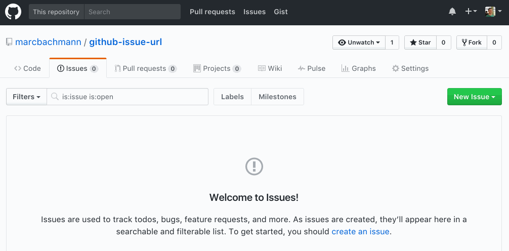

[//]: <> (This file is generated from /README.tpl.md. Please don't edit the one in the root directory)

#  Github Issue Templates

At livingdocs we're actively using github for all our projects. One missing feature we want in github is to be able to chose from a list of issue templates.

This code is a first try to improve the current behavior. In this codebase you can find a CLI which is able to extract templates from one file and offers a simple templating setup for the README to render them in a list.

There's also a chrome extension in here that benefits of the same code to render a template chooser on the github issue page.

### Example

Create a new issue from one of those templates:<br>


&nbsp;{{ pipe() }}&nbsp;[{{template.name}}](http://github.com/marcbachmann/github-issue-templates/issues/new?{{ template.url }})


Those links/templates are generated out of the templates file in .github/ISSUE_TEMPLATES.md

You can use the chrome extension to automatically load that file and render dropdown on the github issue page.

Example of the chrome extension:


### Usage

Create the file `.github/ISSUE_TEMPLATES.md`.  
Check the content in [github-issues-templates/.github/ISSUE_TEMPLATES])(./.github/ISSUE_TEMPLATES.md) for an example config.

```bash
# Run
$ github-issue-templates

# the previous command has those defaults
$ github-issue-templates --source ./README.tpl.md --destination ./README.md

# the help lists all options
$ github-issue-templates --help
```
